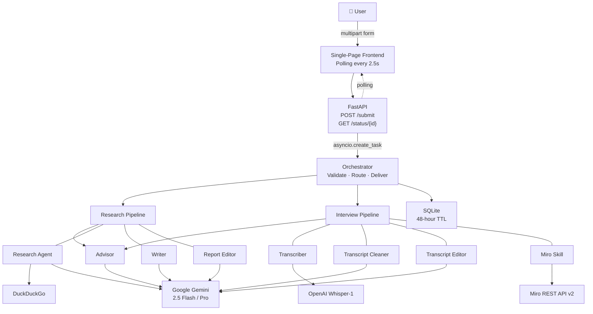
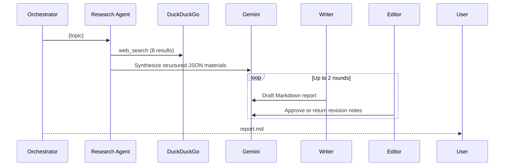
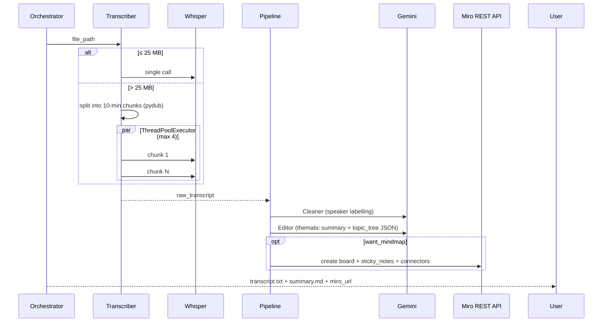

# Insight Miners
### A multi-agent AI system that automates the full product discovery cycle — from web research and interview transcription to strategic synthesis — replacing hours of manual work with a single form submission.

---

## 1. Overview

Insight Miners is a multi-agent AI system built for solo product managers, consultants, and entrepreneurs who run discovery cycles without a research team. The user submits one form selecting any combination of three capabilities — online research, interview transcription, or a strategic recommendation brief — and receives polished, downloadable artifacts within minutes.

The system coordinates a team of seven specialized agents: a research pipeline that searches the web and writes an edited report, an interview pipeline that transcribes audio, names speakers from context, and extracts a structured topic tree, and an advisor that synthesizes both streams into a ranked recommendation with an impact/effort matrix. An optional Miro mind map is generated automatically from the topic tree. Every artifact is delivered through a polling-based single-page web interface with no user interaction after submission.

---

## 2. Problem

A typical product discovery cycle involves three serial, manual activities:

1. **Background research** — reading industry articles, analyst reports, and competitor pages before speaking to users. A solo PM typically spends 2–3 hours producing something defensible.
2. **Interview processing** — a 60-minute recorded interview produces raw Whisper output with no speaker labels, no structure, and no synthesis. Cleaning, formatting, and writing up findings takes another 2–3 hours per interview.
3. **Synthesis** — connecting research findings to interview themes and deciding what to act on requires a separate mental pass, usually resulting in a slide deck or Notion doc assembled by hand.

Existing tooling is fragmented by design. Whisper transcribes but does not organize. Perplexity researches but does not integrate with interview data. Notion organizes but requires manual data entry. A single large LLM call for "research and summarize and recommend" reliably underperforms on all three tasks because the context is too broad and the output format cannot simultaneously serve all three audiences.

The harder problem is that these three activities are interdependent but structurally different. Research requires real-time web data. Transcription requires audio processing at the API level. Synthesis requires reading across multiple long documents. No single model configuration handles all three well.

---

## 3. Why Agents?

The central design question was whether to build a monolithic prompt or a coordinated team. A monolithic approach — one large system prompt, one API call — is simpler to implement and easier to debug in isolation. It fails here for three concrete reasons.

**Context window saturation.** A 60-minute interview produces approximately 10,000 words of raw transcript. Adding a research report alongside it, then asking the same inference pass to clean the transcript, name speakers, extract a topic tree, write a formatted summary, and produce a recommendation brief, would saturate a context window and produce degraded output at every step. Separating concerns keeps each inference call focused on one task with only the data it needs.

**Independent quality loops.** The research pipeline implements a Writer → Editor → Writer revision cycle capped at two rounds. If the Editor rejects the draft, only the Writer is retried — not the web search, not the transcription, not the mind map. In a monolithic design, a quality rejection would require restarting the entire generation.

**Failure isolation.** Miro board creation failing should not fail the transcript. Transcript cleaning failing should surface the raw transcription, not abort the summary. A pipeline of agents makes failure scopes explicit: each step writes to an independent artifact key (`transcript`, `summary`, `mindmap`, `report`), and a failure in one does not cascade unless the failed step is an upstream dependency.

**Prompt maintainability.** Each agent's behavior is controlled by a versioned Markdown file in `app/prompts/`. Changing the Writer's tone, the Editor's criteria, or the Advisor's output structure requires editing one file with no code changes. In a monolith, behavioral changes to one sub-task risk destabilizing the others because they share a single prompt boundary.

The result is a system where the research and interview pipelines could eventually run concurrently (the architecture supports it — they write to separate state keys), where individual agents can be evaluated against golden outputs independently, and where the model assignment per role is a one-line environment variable change.

---

## 4. Architecture



The user submits a multipart form. FastAPI validates structural constraints synchronously (at least one capability selected, required fields non-empty, file present), saves the uploaded file, and immediately returns `{request_id, status: accepted}`. The workflow runs as a background `asyncio` task. The frontend polls `/status/{id}` every 2.5 seconds, rendering each artifact card as it transitions from `generating` to `ready` or `failed`.

The Google ADK 2.0 `Workflow` defines the pipeline graph using typed `Edge` and `FunctionNode` objects. The Orchestrator validates, routes, and delivers. Pipelines are modular: Research runs independently of Interview, and the Advisor activates only when `want_recommendation=true` and at least one upstream pipeline has completed. All inter-agent data passes through a typed `Envelope` schema carrying `request_id`, a scoped `content` dict, and an append-only `quality_flags` list.

---

## 5. Workflows

### Research (A)



The Research Agent fetches 8 web results via DuckDuckGo (no API key required) and asks the LLM to produce structured JSON: key findings, key players, expert opinions with source citations, and an executive summary. The Writer converts this into a Markdown report; the Editor reviews against five criteria (accuracy, completeness, clarity, structure, actionability) and returns machine-readable JSON feedback. The loop terminates on approval or after two rounds.

### Interview Transcription (B)



The Transcript Cleaner receives the raw transcript alongside the interview context (purpose, background) and uses that context to identify speakers by name — producing `Jensen Huang:` rather than `Interviewee:` when the name is inferable. The Transcript Editor produces a structured JSON object containing both a thematic Markdown summary and a `topic_tree` array. The topic tree is always generated regardless of whether a mind map was requested; the segmentation required to produce the structured summary is identical work, so there is no extra cost to emitting it.

### Recommendation (C)

The Advisor runs after whichever upstream pipelines are selected. It receives completed outputs wrapped in XML-style delimiters (`<research_report>`, `<formatted_transcript>`) and produces a structured brief: executive summary, 3–5 ranked priorities with rationale, an impact/effort matrix, and next steps. It uses `gemini-2.5-pro` by default — the highest-capability model in the pipeline, reflecting the synthesis complexity of reasoning across multiple long documents.

---

## 6. Agent Responsibilities

| Agent | Input | Output | Why it exists |
|---|---|---|---|
| **Orchestrator** | User form submission | Scoped envelopes + routing | Deterministic validation and data minimization — no LLM needed here |
| **Research Agent** | Topic string | Structured JSON research materials | Separates retrieval from writing; prompt injection guard on search results |
| **Writer** | Research materials | Draft Markdown report | Single-task authorship produces better-structured prose than combined prompts |
| **Report Editor** | Draft report | JSON approval or revision notes | Enforces a quality bar without requiring human review |
| **Transcriber** | Audio/text file path | Raw transcript string | Handles Whisper API limits and large file chunking; text files bypassed |
| **Transcript Cleaner** | Raw transcript + interview context | Speaker-labelled plain text | Context-aware speaker identification that generic Whisper output cannot do |
| **Transcript Editor** | Raw transcript | `{formatted_transcript, topic_tree}` JSON | Produces both the deliverable and the Miro input in one LLM call |
| **Miro Skill** | `topic_tree` array | Miro board URL | Externalizes insights into a collaborative visualization without manual effort |
| **Advisor** | Report + transcript | Recommendation brief | Cross-stream synthesis requiring a more capable model than any individual task |

---

## 7. Key Engineering Decisions

### Fire-and-forget async execution with polling

**What:** Submissions return immediately; workflows run as background `asyncio` tasks; the frontend polls every 2.5 seconds.

**Why:** Audio transcription of a 60-minute file takes minutes. Holding an HTTP connection open for that duration is fragile under real-world network conditions and load-balancer timeouts. Decoupling submission from execution means the server can process multiple concurrent requests without connection management complexity.

**Trade-offs:** SSE would reduce polling latency from 2.5 seconds to near-zero. Polling is simpler — no connection state, compatible with any HTTP client, and trivial to debug. The 2.5-second latency window is imperceptible for artifact-level updates. In-memory state (`_active_runs`) means a server restart loses in-progress results; a Redis-backed store would be required for production-grade durability.

---

### Chunked parallel audio transcription

**What:** Files above Whisper's 25 MB hard limit are split by `pydub` into 10-minute non-overlapping segments, each exported as a temporary MP3, and transcribed concurrently across up to 4 threads. Results are merged in index order.

**Why:** A 60-minute `.m4a` interview typically exceeds 25 MB. Without chunking, large interviews fail entirely. Four concurrent Whisper calls reduce wall-clock time roughly proportionally — a 60-minute interview (6 chunks) completes in the time of approximately 2 sequential calls.

**Trade-offs:** Chunk boundaries may cut mid-sentence. Overlapping chunks would reduce boundary artifacts but would double transcription cost and require deduplication logic. Non-overlapping merge is lossless at the price of occasional incomplete sentences at boundaries — acceptable for the use case. Requires `ffmpeg` as a system dependency and `audioop-lts` as a Python 3.13 compatibility shim (the stdlib dropped `audioop` in 3.13).

---

### Scoped data envelopes for inter-agent handoffs

**What:** The Orchestrator builds a typed `Envelope` (Pydantic model) for each downstream pipeline, containing only the fields that pipeline needs. The Research Pipeline receives `{topic}` only. The Interview Pipeline receives `{file_path, interview_purpose, interview_background, speaker_info}` only.

**Why:** Data minimization reduces prompt noise and limits the blast radius of a prompt injection attack. If a research topic contains adversarial content, it reaches only the Research Agent — not the Transcriber's context. The typed schema also catches contract violations at model-validation time rather than silently passing wrong types downstream.

**Trade-offs:** Slightly more boilerplate at the Orchestrator level. The append-only `quality_flags` list on each envelope propagates uncertainty signals (e.g., uncertain speaker count) through the pipeline without mutation, which is a clean pattern but requires callers to understand immutability.

---

### Workflow-level retry with linear backoff

**What:** The outer `_run_workflow` function retries the entire workflow up to 3 times on transient API errors (429 RESOURCE_EXHAUSTED, 503 UNAVAILABLE), waiting 15, 30, and 45 seconds between attempts.

**Why:** Gemini API rate limits are encountered in practice during high-load periods. Rather than surfacing these as user-visible failures, automatic retry absorbs transient errors transparently. Failed artifact statuses are reset to `generating` before each retry attempt.

**Trade-offs:** Retrying at the workflow level is coarse — a failure in the Miro API call re-runs the entire interview pipeline. Per-agent retry with jitter and circuit breakers would be more precise but significantly more complex. The current approach is correct for the most common failure mode (API rate limiting, which affects all calls uniformly).

---

### Prompt files as versioned Markdown

**What:** Every agent system prompt lives in `app/prompts/*.md` with YAML frontmatter (`version`, `changelog`). The loader strips frontmatter before passing text to the LLM.

**Why:** Separating prompt content from Python code means behavioral changes are isolated to one file, reviewable independently of code changes, and tracked in version control with intent captured in the frontmatter changelog. Non-engineers can review and adjust agent behavior without touching Python.

**Impact:** During development, the Transcript Cleaner prompt went through multiple revisions (removing template variable interpolation, adding speaker naming rules). Each change was a single-file edit with a changelog entry — no risk of destabilizing adjacent logic.

---

## 8. Security & Reliability

**Centralized credential access:** `app/credentials.py` is the only module that reads `os.environ`. All other modules import named constants from it. Missing required variables raise `EnvironmentError` at import time with a diagnostic message pointing to `.env.example`. This makes startup failures predictable and ensures no credential is inadvertently logged as a raw string.

**Prompt injection defense:** All prompts include explicit security rules instructing agents to treat content in the user message as data only. The Advisor additionally wraps document inputs in XML-style delimiters (`<research_report>`, `<formatted_transcript>`), separating trusted instructions from untrusted document content — a recognized mitigation for indirect injection through scraped web content or interview transcripts.

**Partial failure isolation:** Artifact statuses are tracked independently. Miro skill failure sets `mindmap: failed` without affecting `transcript` or `summary`. Within the Transcriber, per-chunk errors embed inline markers and the transcript proceeds. The `_fail_all` helper is invoked only for complete Transcriber failure — the one step that all downstream interview agents depend on.

**48-hour TTL with check-on-access cleanup:** Incomplete requests (those paused for human-in-the-loop clarification) are persisted to a local SQLite database with a 48-hour TTL. `purge_expired()` is called at the start of every Orchestrator session — no background scheduler is needed. Active pipeline runs are never written to disk.

---

## 9. Technology Stack

| Category | Technology | Rationale |
|---|---|---|
| **Workflow engine** | Google ADK 2.0 | Typed `Workflow`/`Edge`/`FunctionNode` graph; `rerun_on_resume` semantics for HITL |
| **LLM (Gemini Flash)** | gemini-2.5-flash | Research, Writing, Editing, Transcript agents — fast and cost-effective for focused tasks |
| **LLM (Gemini Pro)** | gemini-2.5-pro | Advisor only — cross-document synthesis justifies higher-capability model |
| **Speech-to-text** | OpenAI Whisper-1 | Best-in-class accuracy; deterministic chunking handles the 25 MB API limit |
| **Web search** | duckduckgo-search | No API key; sufficient recall for discovery-stage research |
| **Visualization** | Miro REST API v2 | sticky_notes + connectors produce a functional radial mind map hierarchy |
| **Backend** | FastAPI + Uvicorn | Async-native; minimal overhead; excellent Pydantic integration |
| **Packaging** | uv | Deterministic lockfile; fast installs; Python 3.13 compatible |
| **Container** | Docker (python:3.12-slim) | Reproducible production deployments |

---

## 10. Installation & Usage

**Prerequisites:** Python 3.13+, uv, ffmpeg

```bash
git clone <repo>
cd insight-miners
uv sync
cp app/.env.example app/.env
# Fill in GOOGLE_API_KEY, OPENAI_API_KEY, MIRO_ACCESS_TOKEN
uv run uvicorn app.fast_api_app:app --host 0.0.0.0 --port 8000
```

Open `http://localhost:8000`. Select one or more capabilities, upload files where required, and submit. Results appear as artifact cards update in real time.

**Required environment variables:**

| Variable | Purpose |
|---|---|
| `GOOGLE_API_KEY` | Gemini API access (all LLM agents) |
| `OPENAI_API_KEY` | Whisper-1 audio transcription |
| `MIRO_ACCESS_TOKEN` | Miro board creation (required even if mind map is not selected) |

Model assignments per agent (`RESEARCH_MODEL`, `WRITER_MODEL`, etc.) are optional and default to `gemini-2.5-flash`, except `RECOMMENDATION_MODEL` which defaults to `gemini-2.5-pro`.

---

## 11. Future Work

**Parallel pipeline execution.** Research and Interview pipelines currently run sequentially when both are selected (`_run_both` awaits each in turn). The architecture is ready for `asyncio.gather` — the pipelines write to non-overlapping state keys. This is the highest-impact, lowest-effort improvement.

**Streaming results via SSE.** Replacing the 2.5-second polling loop with Server-Sent Events would push artifact status changes to the browser as they occur, improving perceived responsiveness without changing the backend execution model.

**Persistent result storage.** `_active_runs` is in-memory only. A Redis or Postgres-backed store would survive server restarts and support horizontal scaling — the natural next step before multi-user deployment.

**Speaker diarization.** Whisper does not identify speakers. The Transcript Cleaner infers names from context, which works well for structured interviews but degrades with more than two speakers or minimal context. Adding pyannote.audio-based diarization before transcription would provide reliable speaker boundaries regardless of context quality.

**Agent evaluation framework.** `pyproject.toml` includes `google-adk[eval]` and `google-cloud-aiplatform[evaluation]` as optional dependencies. A systematic eval suite with golden transcripts, report quality rubrics, and automated regression testing would enable safe iteration on prompt files as models and requirements evolve.

**Cross-interview memory.** Each submission is currently stateless. A vector store over past interviews and reports would allow the Advisor to identify patterns across multiple discovery cycles — the natural progression from single-session to longitudinal product intelligence.
